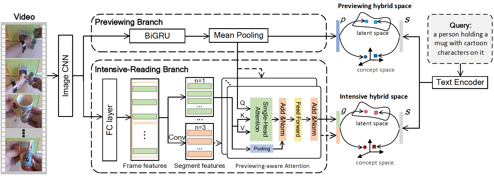

# Reading-strategy Inspired Visual Representation Learning for Text-to-Video Retrieval

Source code of our paper [Reading-strategy Inspired Visual Representation Learning for Text-to-Video Retrieval](https://arxiv.org/abs/2201.09168). 




## Table of Contents

* [Environments](#environments)
* [Required Data](#required-data)
* [RIVRL on MSRVTT10K](#RIVRL-on-MSRVTT10K)
  * [Model Training and Evaluation](#model-training-and-evaluation)
  * [Evaluation using Provided Checkpoints](#Evaluation-using-Provided-Checkpoints)
  * [Expected Performance](#Expected-Performance)
* [RIVRL on VATEX](#RIVRL-on-VATEX)
  * [Model Training and Evaluation](#model-training-and-evaluation-1)
  * [Expected Performance](#Expected-Performance-1)
* [RIVRL on TGIF](#RIVRL-on-TGIF)
  * [Model Training and Evaluation](#model-training-and-evaluation-2)
  * [Expected Performance](#Expected-Performance-2)
* [Reference](#Reference)

  

## Environments

* CUDA 10.1

* Python 3.8.5

* PyTorch 1.7.0


We used Anaconda to setup a deep learning workspace that supports PyTorch. Run the following script to install the required packages.  

```shell
conda create --name rivrl_env python=3.8.5
conda activate rivrl_env
git clone https://github.com/LiJiaBei-7/rivrl.git
cd rivrl
pip install -r requirements.txt
conda deactivate
```


## Required Data

We use three public datasets: MSR-VTT, VATEX, and TGIF. Please refer to [here](https://github.com/danieljf24/hybrid_space/tree/master/dataset) for detailed description and how to download the datasets. Since our model uses additional Bert features, you shall download the pre-extracted Bert features from Baidu pan ([url](https://pan.baidu.com/s/1K7KJ_dc9UgL5u9UQ9DXndw), password:6knd). You can also run the following script to download the features of BERT, the extracted data is placed in `$HOME/VisualSearch/`.

```shell
ROOTPATH=$HOME/VisualSearch
mkdir -p $ROOTPATH && cd $ROOTPATH
mkdir bert_extract && cd bert_extract

# download the features of BERT
wget http://8.210.46.84:8787/rivrl/bert/<bert-Name>.tar.gz
tar zxf <bert-Name>.tar.gz -C $ROOTPATH
# <bert-Name> is msrvtt_bert, vatex_bert, and tgif_bert respectively.
```

## RIVRL on MSRVTT10K

### Model Training and Evaluation

Run the following script to train and evaluate `RIVRL` network. Specifically, it will train `RIVRL` network and select a checkpoint that performs best on the validation set as the final model. Notice that we only save the best-performing checkpoint on the validation set to save disk space.

```shell
ROOTPATH=$HOME/VisualSearch

conda activate rivrl_env

# To train the model on the MSR-VTT, which the feature is resnext-101_resnet152-13k 
# Template:
./do_all_msrvtt.sh $ROOTPATH <split-Name> <useBert> <gpu-id>

# Example:
# Train RIVRL with the BERT on MV-Yu 
./do_all_msrvtt.sh $ROOTPATH msrvtt10yu 1 0
```
`<split-Name>` indicates different partitions of the dataset.  `msrvtt10yu`, `msrvtt10k`，`msrvtt10kmiech` respectively denotes the partition of MV-Yu, MV-Miech and MV-Xu.
`<useBert>` indicates whether training with BERT as additional text feature. 1 means using the BERT feature, while 0 indicates we do not use it.
`<gpu-id>` is the index of the GPU where we train on.


### Evaluation using Provided Checkpoints

Run the following script to download and evaluate our trained checkpoints. The trained checkpoints can also be downloaded from Baidu pan ([url](https://pan.baidu.com/s/1dEmmhpS3x_WvuMyzDZI40Q), password:wb3c).

```shell
ROOTPATH=$HOME/VisualSearch

# download trained checkpoints
wget -P $ROOTPATH http://8.210.46.84:8787/rivrl/best_model/msrvtt/<best_model>.pth.tar
# <best_model> is mv_yu_best, mv_yu_Bert_best, mv_miech_best, mv_miech_Bert_best, mv_xu_best, or mv_xu_Bert_best.
tar zxf $ROOTPATH/<best_model>.pth.tar -C $ROOTPATH

# evaluate on MSR-VTT
# Template:
./do_test.sh $ROOTPATH <split-Name> $MODELDIR <gpu-id>
# $MODELDIR is the path of checkpoints, $ROOTPATH/.../runs_0

# Example:
# evaluate on MV-Yu
./do_test.sh $ROOTPATH msrvtt10kyu $MODELDIR 0
```


### Expected Performance

The expected performance and corresponding pre-trained checkpoints of RIVRL on MSR-VTT is as follows. Notice that due to random factors in SGD based training, the numbers differ slightly from those reported in the paper.

<table>
  <tr align="center">
    <th rowspan='2'>DataSet</th><th rowspan="2">Splits</th><th rowspan='2'>BERT</th><th colspan='5'>Text-to-Video Retrieval</th> <th rowspan='2'>SumR</th> <th rowspan='2'>Pre-trained Checkpoints</th>
    </tr>
  <tr align="center">
        <th> R@1 </th> <th> R@5 </th> <th> R@10 </th> <th> MedR </th> <th>	mAP </th>
  </tr>
   <tr align="center">
     <td rowspan='6'>MSR-VTT</td>
    <td rowspan='2'>MV-Yu</td>
    <td>w/o</td>
    <td>24.2</td><td>51.5</td><td>63.8</td><td>5</td><td>36.86</td> 
    <td>139.5</td>
    <td>mv_yu_best.pth.tar</td>
  </tr>
   <tr align="center">
    <td>with</td>
    <td>27.9</td><td>59.3</td><td>71.3</td><td>4</td><td>42.0</td> 
    <td>158.4</td>
     <td>mv_yu_Bert_best.pth.tar</td>
  </tr>
  <tr align="center">
    <td rowspan='2'>MV-Miech</td>
    <td>w/o</td>
    <td>25.3</td><td>53.6</td><td>67.0</td><td>4</td><td>38.5</td> 
    <td>145.9</td> 
    <td>mv_miech_best.pth.tar</td>
  </tr>
  <tr align="center">
    <td>with</td>
    <td>26.2</td><td>56.6</td><td>68.2</td><td>4</td><td>39.92</td> 
    <td>151.0</td> 
    <td>mv_miech_Bert_best.pth.tar</td>
  </tr>
 		<tr align="center">	  
    <td rowspan='2'>MV-Xu</td>
    <td>w/o</td>
    <td>12.9</td><td>33.0</td><td>44.6</td><td>14</td><td>23.07</td> 
    <td>90.5</td>
    <td>mv_xu_best.pth.tar</td>
  </tr>
  <tr align="center">
    <td>with</td>
     <td>13.7</td><td>34.6</td><td>46.4</td><td>13</td><td>24.19</td> 
   	 <td>94.6</td>
    <td>mv_xu_Bert_best.pth.tar</td>
  </tr>  
</table>


## RIVRL on VATEX

### Model Training and Evaluation

Run the following script to train and evaluate `RIVRL` network on VATEX.

```shell
ROOTPATH=$HOME/VisualSearch

conda activate rivrl_env

# To train the model on the VATEX
./do_all_vatex.sh $ROOTPATH <useBert> <gpu-id>
```

### Expected Performance

Run the following script to download and evaluate our trained model on the VATEX from Baidu pan ([url](https://pan.baidu.com/s/1dEmmhpS3x_WvuMyzDZI40Q), password:wb3c).

```shell
ROOTPATH=$HOME/VisualSearch

# download trained checkpoints and evaluate 
wget -P $ROOTPATH http://8.210.46.84:8787/rivrl/best_model/vatex/<best_model>.pth.tar
# <best_model> is vatex_best or vatex_Bert_best
tar zxf $ROOTPATH/<best_model>.pth.tar -C $ROOTPATH

# evaluate on VATEX
./do_test.sh $ROOTPATH vatex $MODELDIR <gpu-id>
# $MODELDIR is the path of checkpoints, $ROOTPATH/.../runs_0
```

The expected performance and corresponding pre-trained checkpoints of RIVRL on VATEX is as follows.

<table>
  <tr align="center">
    <th rowspan='2'>DataSet</th><th rowspan="2">Splits</th><th rowspan='2'>BERT</th><th colspan='5'>Text-to-Video Retrieval</th> <th rowspan='2'>SumR</th><th rowspan='2'>Pre-trained Checkpoints</th>
    </tr>
  <tr align="center">
        <th> R@1 </th> <th> R@5 </th> <th> R@10 </th> <th> MedR </th> <th>	mAP </th>
  </tr>
  <tr align="center">
    <td colspan='2' rowspan ='2' align="center">VATEX</td>
    <td>w/o</td>
    <td>39.4</td><td>76.1</td><td>84.8</td><td>2</td><td>55.3</td> 
    <td>200.4</td>
    <td>vatex_best.pth.tar</td>
  </tr>
	<tr align="center">
    <td>with</td>
    <td>39.1</td><td>76.7</td><td>85.4</td><td>2</td><td>55.4</td> 
    <td>201.0</td>
    <td>vatex_Bert_best.pth.tar</td>
  </tr>
</table>


## RIVRL on TGIF

### Model Training and Evaluation

Run the following script to train and evaluate `RIVRL` network on TGIF.

```shell
ROOTPATH=$HOME/VisualSearch

conda activate rivrl_env

# To train the model on the TGIF-Li
./do_all_tgif_li.sh $ROOTPATH <useBert> <gpu-id>

# To train the model on the TGIF-Chen
./do_all_tgif_chen.sh $ROOTPATH <useBert> <gpu-id>
```

### Expected Performance

Run the following script to download and evaluate our trained model on the TGIF from Baidu pan ([url](https://pan.baidu.com/s/1dEmmhpS3x_WvuMyzDZI40Q), password:wb3c).

```shell
ROOTPATH=$HOME/VisualSearch

# download trained checkpoints 
wget -P $ROOTPATH http://8.210.46.84:8787/rivrl/best_model/tgif/<best_model>.pth.tar
# <best_model> is tgif_li_best, tgif_li_Bert_best, tgif_chen_best and tgif_chen_Bert_best, respectively.
tar zxf $ROOTPATH/<best_model>.pth.tar -C $ROOTPATH

# evaluate on the TGIF-Li
./do_test.sh $ROOTPATH tgif-li $MODELDIR <gpu-id>

# evaluate on the TGIF-Chen
./do_test.sh $ROOTPATH tgif-chen $MODELDIR <gpu-id>
# $MODELDIR is the path of checkpoints, $ROOTPATH/.../runs_0
```

The expected performance and corresponding pre-trained checkpoints of RIVRL on TGIF is as follows.

<table>
  <tr align="center">
    <th rowspan='2'>DataSet</th><th rowspan="2">Splits</th><th rowspan='2'>BERT</th><th colspan='5'>Text-to-Video Retrieval</th> <th rowspan='2'>SumR</th><th rowspan='2'>Pre-trained Checkpoints</th>
    </tr>
  <tr align="center">
        <th> R@1 </th> <th> R@5 </th> <th> R@10 </th> <th> MedR </th> <th>	mAP </th>
  </tr>
  <tr align="center">	  
    <td rowspan='4'>TGIF</td>
    <td rowspan='2'>TGIF-Li</td>
    <td>w/o</td>
    <td>11.3</td><td>25.3</td><td>33.6</td><td>34</td><td>18.7</td> 
    <td>70.3</td>
    <td>tgif_li_best.pth.tar</td>
  </tr>
   <tr align="center">	  
    <td>with</td>
    <td>12.1</td><td>26.6</td><td>35.1</td><td>29</td><td>19.75</td> 
    <td>73.8</td> 
    <td>tgif_li_Bert_best.pth.tar</td>
  </tr>
   <tr align="center">	  
    <td rowspan='2'>TGIF-Chen</td>
    <td>w/o</td>
    <td>6.4</td><td>16.1</td><td>22.4</td><td>91</td><td>11.81</td> 
    <td>44.9</td>  
    <td>tgif_chen_best.pth.tar</td>
  </tr>
  <tr align="center">	  
    <td>with</td>
    <td>6.8</td><td>17.2</td><td>23.5</td><td>79</td><td>12.45</td> 
    <td>47.4</td> 
    <td>tgif_chen_Bert_best.pth.tar</td>
  </tr>
</table>


## Reference

If you find the package useful, please consider citing our paper:

```
@article{dong2022reading,
  title={Reading-strategy Inspired Visual Representation Learning for Text-to-Video Retrieval},
  author={Dong, Jianfeng and Wang, Yabing and Chen, Xianke and Qu, Xiaoye and Li, Xirong and He, Yuan and Wang, Xun},
  journal={IEEE Transactions on Circuits and Systems for Video Technology},
  year={2022}
}
```

