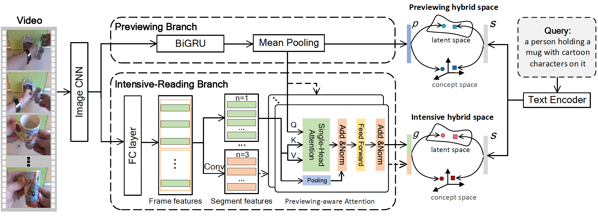

# Reading-strategy Inspired Visual Representation Learning for Text-to-Video Retrieval

Source code of our paper [Reading-strategy Inspired Visual Representation Learning for Text-to-Video Retrieval](https://arxiv.org/abs/). 




## Table of Contents

* [Environments](#environments)
* [Training RIVRL](#training-rivrl)
  * [Required Data](#required-data)
  * [Model Training and Evaluation](#model-training-and-evaluation)
* [Model Training and Evaluation](#Model-Training-and-Evaluation)
* [Evaluating a trained model](#Evaluating-a-trained-model)
* [Evaluation using Provided Checkpoints](#Evaluation-using-Provided-Checkpoints)
* [Expected Performance](#Expected-Performance)

## Environments

* CUDA 10.1

* Python 3.8.5

* PyTorch 1.7.0


We used Anaconda to setup a deep learning workspace that supports PyTorch. Run the following script to install the required packages.  

```shell
conda create --name rivrl_env python=3.8.5
conda activate rivrl_env
git clone https://github.com/LiJiaBei-7/rivrl.git
cd rivrl
pip install -r requirements.txt
conda deactivate
```


## Training RIVRL

###  Required Data

<table>
  <tr align="center">
    <th rowspan='2'>DataSets</th><th rowspan="2">Splits</th><th colspan='2'>Feature-Url</th> 			<th colspan='2'>DataSets-Url</th><th rowspan='2'>BERT</th>
  </tr>
  <tr align="center">
    <th>Baidu pan</th><th>Google drive</th><th>Baidu pan</th> <th>Google drive</th>
  </tr>
 	<tr align="center">	  
    <td colspan='2'>MSR-VTT</td>
    <td><a href='https://pan.baidu.com/s/1VYFgKEo37eJpV_DlEmSA3w'>url</a>，password:wpeb</td>
    <td><a href='http://8.210.46.84:8787/checkpoints/msrvtt10k_model_best.pth.tar'>msrvtt10k-resnext101<br>_resnet152.tar.gz(4.3G)</a></td>
    <td><a href='https://pan.baidu.com/s/1lg23K93lVwgdYs5qnTuMFg'>url</a>，password:p3p0</td> 
    <td><a href='https://drive.google.com/drive/folders/1TEIjErztZNQAi6AyNu9cK5STwo74oI8I?usp=sharing'>url</a></td>
    <td><a href='https://pan.baidu.com/s/1iH4Ey2IJLcCdUzXqi3mYUQ
      '>url</a>,
      password:cibp</td>
  </tr>
  <tr align="center">
    <td colspan='2' align="center">VATEX</td>
    <td><a href='https://pan.baidu.com/s/1VYFgKEo37eJpV_DlEmSA3w'>url</a>，password:wpeb</td>
    <td><a href='http://8.210.46.84:8787/vatex-i3d.tar.gz'>vatex-i3d.tar.gz(3.0G)</a> </td>
    <td><a href='https://pan.baidu.com/s/1lg23K93lVwgdYs5qnTuMFg'>url</a>，password:p3p0</td>
    <td><a href='https://drive.google.com/drive/folders/1TEIjErztZNQAi6AyNu9cK5STwo74oI8I?usp=sharing'>url</a></td>
    <td><a href='https://pan.baidu.com/s/1iH4Ey2IJLcCdUzXqi3mYUQ
      '>url</a>,
      password:cibp</td>
  </tr>
  <tr align="center">	  
    <td rowspan='2'>TGIF</td>
    <td>Chen</td>
    <td><a href='https://pan.baidu.com/s/1VYFgKEo37eJpV_DlEmSA3w'>url</a>，password:wpeb</td>
    <td> </td>
    <td></td>
    <td></td>
    <td><a href='https://pan.baidu.com/s/1iH4Ey2IJLcCdUzXqi3mYUQ
      '>url</a>,
      password:cibp</td>
  </tr>
  <tr align="center">	  
    <td>Li</td>
    <td><a href='https://pan.baidu.com/s/1VYFgKEo37eJpV_DlEmSA3w'>url</a>，password:wpeb</td>
    <td><a href=''></a> </td>
    <td></td>
    <td></td>
    <td><a href='https://pan.baidu.com/s/1iH4Ey2IJLcCdUzXqi3mYUQ
      '>url</a>,
      password:cibp</td>
  </tr>
</table>

Run the following script to download and extract MSR-VTT(msrvtt10k-resnext101_resnet152.tar.gz(4.3G)) dataset and a pre-trained word2vec (vec500flickr30m.tar.gz(3.0G)). The data can also be downloaded from Baidu pan ([url](https://pan.baidu.com/s/1lg23K93lVwgdYs5qnTuMFg), password:p3p0) or Google drive ([url](https://drive.google.com/drive/folders/1TEIjErztZNQAi6AyNu9cK5STwo74oI8I?usp=sharing)). For more information about the dataset, please refer to [here](rivrl/dataset/README.md).

Additionally, if you want to train with BERT, you can download  the features from Baidu pan ([url](https://pan.baidu.com/s/1iH4Ey2IJLcCdUzXqi3mYUQ), password:cibp) .

The extracted data is placed in `$HOME/VisualSearch/`.

```shell
ROOTPATH=$HOME/VisualSearch
mkdir -p $ROOTPATH && cd $ROOTPATH

# download and extract dataset
wget http://8.210.46.84:8787/<feature.tar.gz>
tar zxf <feature-name.tar.gz> -C $ROOTPATH

# download and extract pre-trained word2vec
wget http://lixirong.net/data/w2vv-tmm2018/word2vec.tar.gz
tar zxf word2vec.tar.gz -C $ROOTPATH

# download the features of BERT
cd $ROOTPATH
tar zxf bert_extract.tar.gz -C $ROOTPATH

# Example:
# download and extract dataset
wget http://8.210.46.84:8787/msrvtt10k-resnext101_resnet152.tar.gz
tar zxf msrvtt10k-resnext101_resnet152.tar.gz -C $ROOTPATH
```


### Model Training and Evaluation

The datasets and their split names are shown in the following table: 

<table>
  <tr align="center">
    <th>DataSets</th><th>Split-Name</th>
  </tr>
  <tr align="center">
    <td rowspan='3'>MSR-VTT</td>
    <td>msrvtt10k</td>
  </tr>
  <tr align="center">
    <td>msrvtt10kmiech</td>
  </tr>
  <tr align="center">
    <td>msrvtt10kyu</td>
  </tr>
  <tr align="center">
    <td rowspan='2'>TGIF</td>
    <td>tgif_li</td>
  </tr>
  <tr align="center">
    <td>tgif_chen</td>
  </tr>
  <tr align="center">
    <td>VATEX</td>
    <td>vatex</td>
  </tr>
</table>


Run the following script to train and evaluate `RIVRL` network. 

Note: You don't need to execute all of the following scripts,  just the data set you need to train.

```shell
ROOTPATH=$HOME/VisualSearch

conda activate rivrl_env
# If you want to train the model on an MSRVTT dataset, execute this script
# To train the model on the MSRVTT, which the feature is resnext-101_resnet152-13k and the partition are msrvtt10k msrvtt10kmiech msrvtt10yu
./do_all_msrvtt.sh $ROOTPATH <split-Name> <useBert> <gpu-id>

# If you want to train the model on an VATEX dataset, execute this script
# To train the model on the VATEX
./do_all_vatex.sh $ROOTPATH <useBert> <gpu-id>

# If you want to train the model on an TGIF dataset, execute this script
# To train the model on the TGIF which feature is resnet152.pth
./do_all_tgif_chen.sh $ROOTPATH <useBert> <gpu-id>
# To train the model on the TGIF which feature is resnext-101_resnet152-13k
./do_all_tgif_li.sh $ROOTPATH <useBert> <gpu-id>
```
where the `<gpu-id>` is the index of the GPU to train on and the `<useBert>` indicates whether training with BERT, the value of it is 1 (use) or 0 (not use).


## Evaluating a trained model

If you want to evaluate the model you trained in the steps above, you can execute the following script：

```shell
# evaluate
CUDA_VISIBLE_DEVICES=0 python tester.py --testCollection <split-Name> --logger_name $MODELDIR --checkpoint_name <path-to-model_best.pth.tar>

# Example:
# evaluate on Test1k-Yu of MSR-VTT
CUDA_VISIBLE_DEVICES=0 python tester.py --testCollection msrvtt10kyu --logger_name $MODELDIR --checkpoint_name <path-to-model_best.pth.tar>
```

where the `<split-Name>` is corresponding to the above table，`<path-to-model_best.pth.tar>` is the save path of Checkpoints .


## Evaluation using Provided Checkpoints


The overview of pre-trained checkpoints on MSR-VTT/VATEX/TGIF are as follows.

<table>
  <tr align='center'>
    <th>DataSets</th><th>Splits</th><th>Bert</th><th>Pre-trained Checkpoints</th>
  </tr>
  <tr align='center'>
  	<td rowspan='6'>MSR-VTT</td>
    <td rowspan='2'>MV-Yu</td>
    <td>w/o</td>
    <td><a href='https://pan.baidu.com/s/1dEmmhpS3x_WvuMyzDZI40Q'>msrvtt10kyu_model_best.pth.tar(436.49M)</a>，password:wb3c</td>
  </tr>
  <tr align='center'>
  	<td>with</td>
    <td><a href='https://pan.baidu.com/s/1dEmmhpS3x_WvuMyzDZI40Q'>msrvtt10kyu_bert_model_best.pth.tar(448.49M)</a>，password:wb3c</td>
  </tr>
  <tr align='center'>
    <td rowspan='2'>MV-Miech</td>
    <td>w/o</td>
    <td><a pref='https://pan.baidu.com/s/1dEmmhpS3x_WvuMyzDZI40Q'>msrvtt10kmiech_model_best.pth.tar(435.53M)</a>，password:wb3c</td>
  </tr>
  <tr align='center'>
  	<td>with</td>
    <td><a href='https://pan.baidu.com/s/1dEmmhpS3x_WvuMyzDZI40Q'>msrvtt10kmiech_bert_model_best.pth.tar(447.53M)</a>，password:wb3c</td>
  </tr>
  <tr align='center'>
    <td rowspan='2'>MV-Xu</td>
    <td>w/o</td>
    <td><a href='https://pan.baidu.com/s/1dEmmhpS3x_WvuMyzDZI40Q'>msrvtt10kxu_model_best.pth.tar()</a>，password:wb3c</td>
  </tr>
  <tr align='center'>
  	<td>with</td>
    <td><a href='https://pan.baidu.com/s/1dEmmhpS3x_WvuMyzDZI40Q'>msrvtt10kxu_bert_model_best.pth.tar(444.53M)</a>，password:wb3c</td>
  </tr>
  <tr align='center'>
  	<td rowspan='4'>TGIF</td>
    <td rowspan='2'>TGIF-Chen</td>
    <td>w/o</td>
    <td><a href='https://pan.baidu.com/s/1dEmmhpS3x_WvuMyzDZI40Q'>tgif_chen_model_best.pth.tar(342.06M)</a>，password:wb3c</td>
  </tr>
  <tr align='center'>
  	<td>with</td>
    <td><a href='https://pan.baidu.com/s/1dEmmhpS3x_WvuMyzDZI40Q'>tgif_chen_bert_model_best.pth.tar(354.06M)</a>，password:wb3c</td>
  </tr>
  <tr align='center'>
    <td rowspan='2'>TGIF-Li</td>
    <td>w/o</td>
    <td><a href='https://pan.baidu.com/s/1dEmmhpS3x_WvuMyzDZI40Q'>tgif_li_model_best.pth.tar(382.06M)</a>，password:wb3c</td>
  </tr>
  <tr align='center'>
  	<td>with</td>
    <td><a href='https://pan.baidu.com/s/1dEmmhpS3x_WvuMyzDZI40Q'>tgif_li_bert_model_best.pth.tar(394.06M)</a>，password:wb3c</td>
  </tr>
  <tr align='center'>
    <td colspan='2' rowspan='2'>VATEX</td>
    <td>w/o</td>
    <td><a href='https://pan.baidu.com/s/1dEmmhpS3x_WvuMyzDZI40Q'>vatex_model_best.pth.tar(420.99M)</a>，password:wb3c</td>
  </tr>
   <tr align='center'>
  	<td>with</td>
    <td><a href='https://pan.baidu.com/s/1dEmmhpS3x_WvuMyzDZI40Q'>vatex_bert_model_best.pth.tar(420.99M)</a>，password:wb3c</td>
  </tr>
</table>  


Run the following script to download and evaluate our trained checkpoints. The trained checkpoints can also be downloaded from Baidu pan ([url](https://pan.baidu.com/s/1dEmmhpS3x_WvuMyzDZI40Q), password:wb3c).

```shell
MODELDIR=$HOME/VisualSearch/checkpoints
mkdir -p $MODELDIR

# download trained checkpoints
# evaluate on the official split of MSR-VTT
CUDA_VISIBLE_DEVICES=0 python tester.py --testCollection msrvtt10k --logger_name $MODELDIR  --checkpoint_name <model_best.pth.tar>
```


## Expected Performance

The expected performance of RIVRL on MSR-VTT is as follows. Notice that due to random factors in SGD based training, the numbers differ slightly from those reported in the paper.

<table>
  <tr align="center">
    <th rowspan='2'>DataSets</th><th rowspan="2">Splits</th><th rowspan='2'>BERT</th><th colspan='5'>Text-to-Video Retrieval</th> <th rowspan='2'>SumR</th>
    </tr>
  <tr align="center">
        <th> R@1 </th> <th> R@5 </th> <th> R@10 </th> <th> MedR </th> <th>	mAP </th>
  </tr>
 	<tr align="center">	  
    <td rowspan='6'>MSR-VTT</td>
    <td rowspan='2'>MV-Xu</td>
    <td>w/o</td>
    <td>12.9</td><td>33.0</td><td>44.6</td><td>14</td><td>23.07</td> 
    <td>90.5</td> 
  </tr>
  <tr align="center">
    <td>with</td>
     <td>13.7</td><td>34.6</td><td>46.4</td><td>13</td><td>24.19</td> 
   	 <td>94.6</td> 
  </tr>  
  <tr align="center">
    <td rowspan='2'>MV-Miech</td>
    <td>w/o</td>
    <td>25.3</td><td>53.6</td><td>67.0</td><td>4</td><td>38.5</td> 
    <td>145.9</td> 
  </tr>
  <tr align="center">
    <td>with</td>
    <td>26.2</td><td>56.6</td><td>68.2</td><td>4</td><td>39.92</td> 
    <td>151.0</td> 
  </tr>
  <tr align="center">
    <td rowspan='2'>MV-Yu</td>
    <td>w/o</td>
    <td>24.2</td><td>51.5</td><td>63.8</td><td>5</td><td>36.86</td> 
    <td>139.5</td>  
  </tr>
   <tr align="center">
    <td>with</td>
    <td>27.9</td><td>59.3</td><td>71.3</td><td>4</td><td>42.0</td> 
    <td>158.4</td>
  </tr>
  <tr align="center">	  
    <td rowspan='4'>TGIF</td>
    <td rowspan='2'>TGIF-Chen</td>
    <td>w/o</td>
    <td>6.4</td><td>16.1</td><td>22.4</td><td>91</td><td>11.81</td> 
    <td>44.9</td>  
  </tr>
  <tr align="center">	  
    <td>with</td>
    <td>6.8</td><td>17.2</td><td>23.5</td><td>79</td><td>12.45</td> 
    <td>47.4</td> 
  </tr>
  <tr align="center">	  
    <td rowspan='2'>TGIF-Li</td>
    <td>w/o</td>
    <td>11.3</td><td>25.3</td><td>33.6</td><td>34</td><td>18.7</td> 
    <td>70.3</td> 
  </tr>
  <tr align="center">	  
    <td>with</td>
    <td>12.1</td><td>26.6</td><td>35.1</td><td>29</td><td>19.75</td> 
    <td>73.8</td> 
  </tr>
   </tr>
   <tr align="center">
    <td colspan='2' rowspan ='2' align="center">VATEX</td>
    <td>w/o</td>
    <td>39.4</td><td>76.1</td><td>84.8</td><td>2</td><td>55.3</td> 
    <td>200.4</td 
  </tr>
	<tr align="center">
    <td>with</td>
    <td>39.1</td><td>76.7</td><td>85.4</td><td>2</td><td>55.4</td> 
    <td>201.0</td> 
  </tr>
</table>


